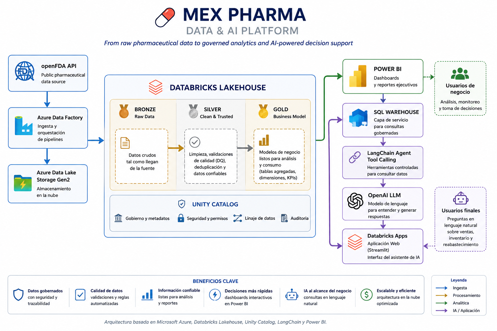
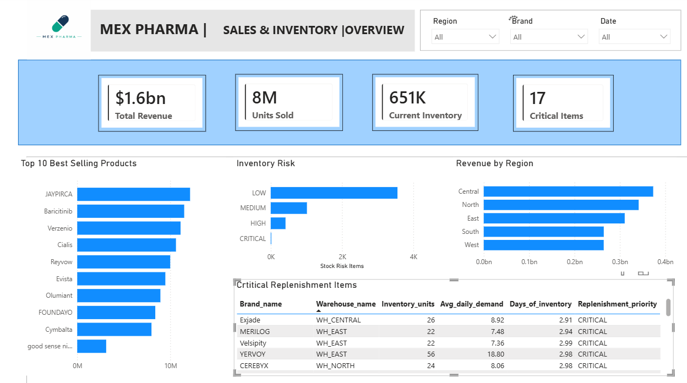

# MEX PHARMA — Plataforma End-to-End de Datos e Inteligencia Artificial
## 👤 Autor: **Manuel Medina**

Data Engineer | Databricks | Azure | Data & AI

Proyecto desarrollado como caso práctico end-to-end de ingeniería de datos, analítica e Inteligencia Artificial.

## Arquitectura de la solución

La plataforma integra ingesta, procesamiento, gobierno, analítica e inteligencia artificial en una sola arquitectura end-to-end.

## La solución en funcionamiento

El proyecto transforma datos farmacéuticos provenientes de una fuente externa (Federal Drug Administration) en información preparada para análisis y toma de decisiones.

## Integración Azure

La solución utiliza Azure Data Factory para la ingesta y orquestación de datos externos.

Los datos provenientes de openFDA son almacenados inicialmente en Azure Data Lake Storage Gen2 como información raw antes de ser procesados en Databricks.

Este patrón permite conservar la fuente original y habilitar reprocesamientos posteriores.

**Flujo:**

openFDA API > Azure Data Factory > ADLS Gen2 > Databricks

### Dashboard ejecutivo

Los datos procesados en Databricks son consumidos desde Power BI para analizar ventas, inventario, desempeño regional y riesgo de reabastecimiento.

### Asistente de Inteligencia Artificial

Además del dashboard tradicional, se desarrolló un asistente que permite consultar los datos utilizando lenguaje natural.

Por ejemplo, un usuario puede preguntar qué productos presentan un riesgo crítico de inventario en una región determinada y obtener una respuesta basada directamente en los datos gobernados de la plataforma.

> **Del dato crudo a la decisión:** la misma plataforma de datos alimenta tanto la analítica ejecutiva en Power BI como un asistente de IA capaz de responder preguntas sobre ventas e inventario.

## Alcance del proyecto

El proyecto demuestra la construcción de una solución **end-to-end**, comenzando con la ingesta de información desde una API pública, continuando con su almacenamiento, procesamiento, validación y modelado mediante una arquitectura Lakehouse, y terminando con dos productos de consumo:

- Un dashboard ejecutivo desarrollado en **Power BI**.
- Un asistente de IA que permite consultar información de ventas, inventario y riesgo de reabastecimiento utilizando lenguaje natural.

El objetivo no es únicamente visualizar datos, sino demostrar cómo diferentes componentes de una plataforma moderna de datos pueden integrarse para transformar información cruda en herramientas que apoyen la toma de decisiones.

---

## Problema de negocio

Una compañía farmacéutica necesita integrar información de productos proveniente de fuentes externas y convertirla en información confiable que pueda utilizarse para analizar:

- desempeño de ventas;
- productos con mayor generación de ingresos;
- comportamiento por región;
- niveles actuales de inventario;
- demanda promedio;
- días disponibles de inventario;
- productos con riesgo de desabasto;
- prioridades de reabastecimiento.

Además de los dashboards tradicionales, se plantea permitir que un usuario de negocio pueda realizar preguntas directamente sobre los datos utilizando lenguaje natural.

Ejemplos:

> **¿Qué productos requieren reabastecimiento urgente?**

> **¿Cuáles son los productos con mayores ventas?**

> **¿Qué región genera mayores ingresos?**

> **¿Qué productos críticos existen en la región East?**

---

## Solución propuesta

Se diseñó una arquitectura de datos que integra servicios de **Microsoft Azure, Databricks, Power BI e Inteligencia Artificial**.

